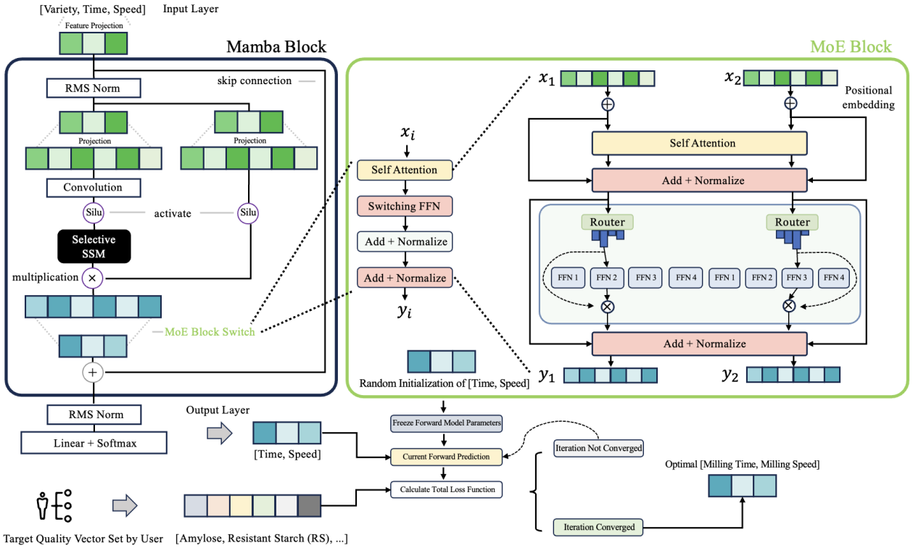
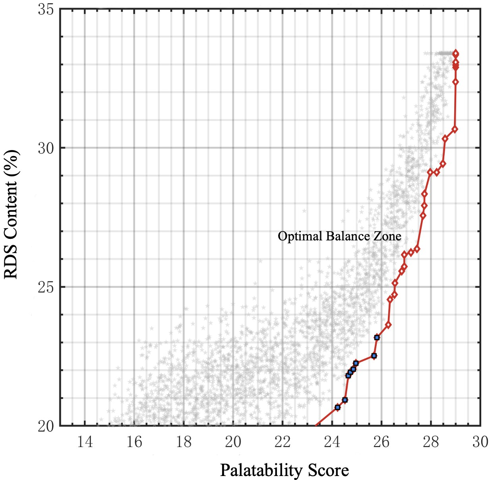
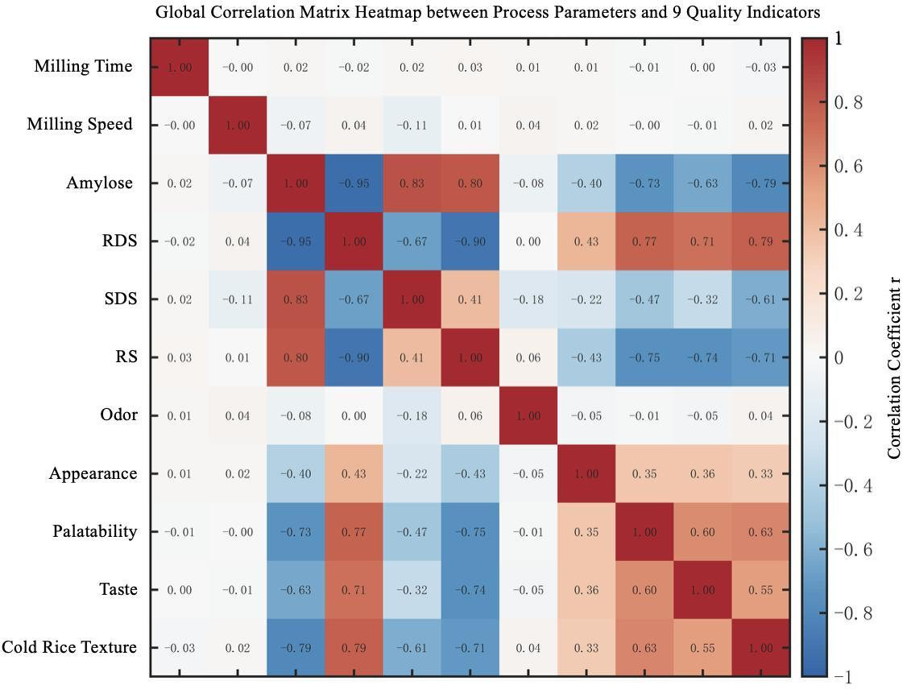
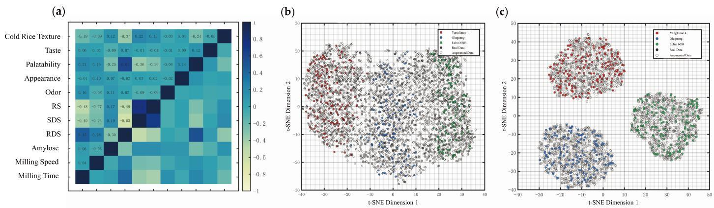
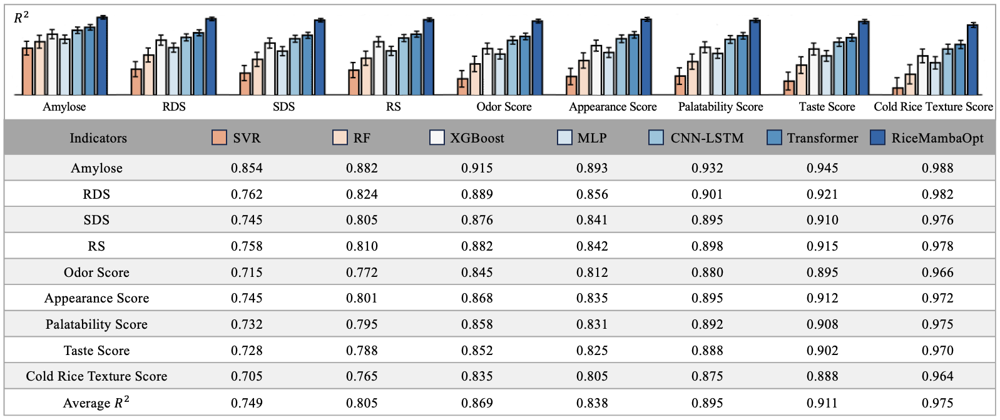
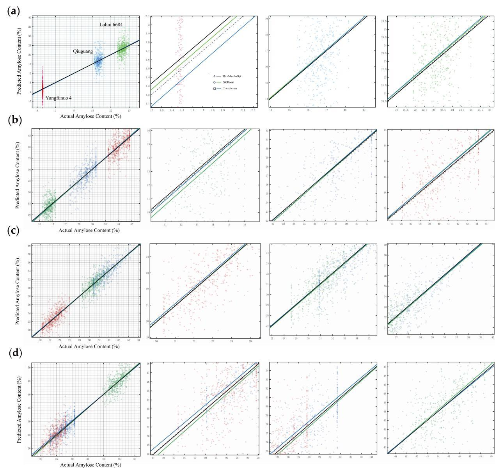
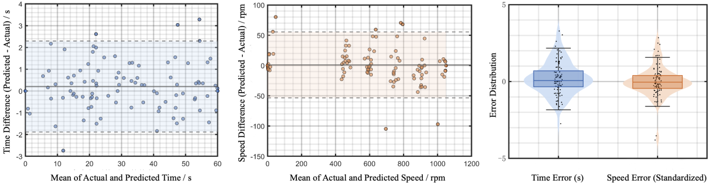
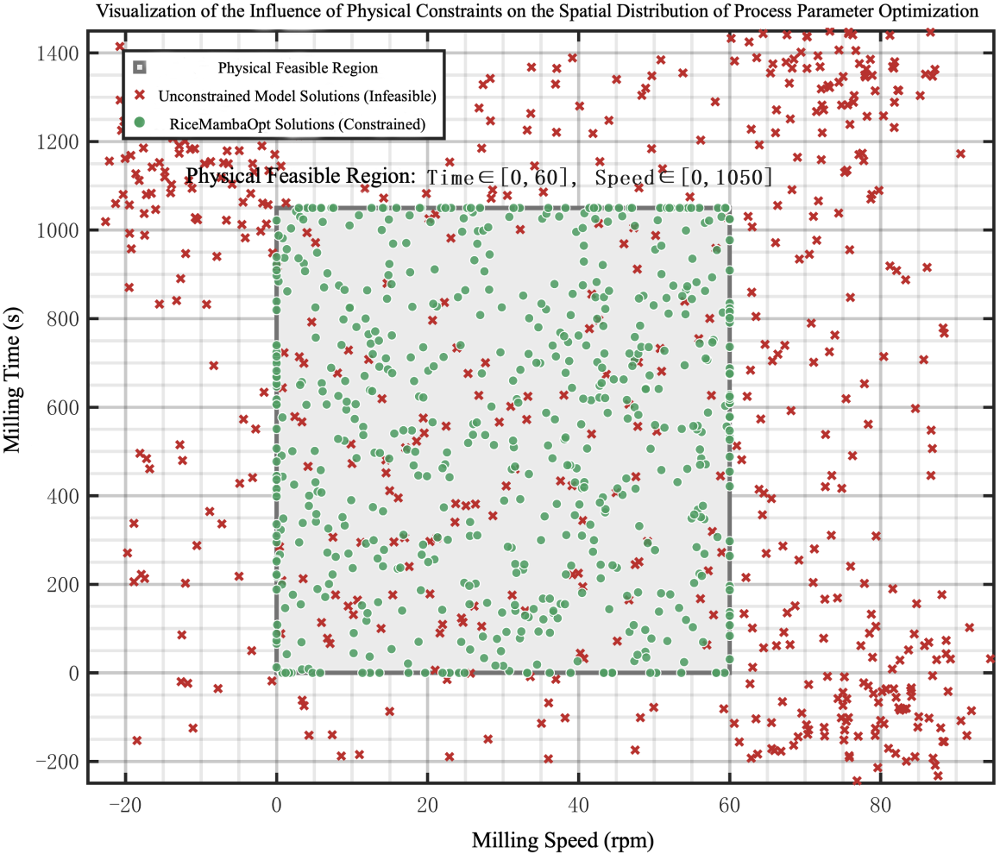
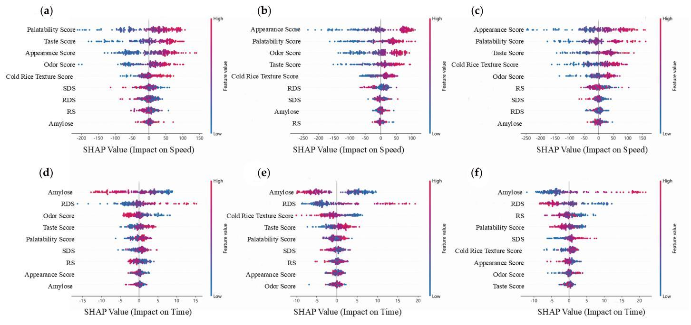

<div align="center">

# RiceMambaOpt

**Constraint-aware forward prediction and inverse design for moderate rice milling**

[](https://doi.org/10.3390/foods15162812)
[](https://doi.org/10.3390/foods15162812)
[](#model-design)
[](#codebase-blueprint)

<sub>TabDDPM · MoE–Mamba · heteroscedastic prediction · constrained inverse optimization</sub>

</div>

RiceMambaOpt links cultivar-aware quality prediction with process-feasibility-constrained inverse design, balancing starch digestibility, sensory quality, and executable milling conditions.

## At a glance

| Process inputs | Forward model | Predicted targets | Inverse output |
|:---|:---|:---|:---|
| Cultivar · milling time · speed | TabDDPM + MoE–Mamba | 9 physicochemical, digestibility, and sensory attributes | Feasible time–speed recommendations |

| Original samples | Development set | Independent holdout | Prospective validation |
|:---:|:---:|:---:|:---:|
| **500** | **400** | **100** | **12 profiles · 36 samples** |

## Model design

1. **Leakage-controlled augmentation** — fold-specific TabDDPM expands sparse tabular observations without accessing validation or holdout samples.
2. **Structured tokenization** — cultivar, milling time, speed, and process-dose features are embedded as process-aware tokens.
3. **Selective state-space learning** — two Mamba blocks capture nonlinear interactions with compact linear-complexity computation.
4. **Cultivar-aware routing** — three specialized experts use top-1 routing to model cultivar-dependent processing responses.
5. **Probabilistic prediction** — the output head estimates the mean and log variance of nine quality attributes.
6. **Constrained inverse design** — multi-start optimization searches the equipment-feasible domain while balancing target error and process constraints.
7. **Mechanistic interpretation** — SHAP and Pareto analysis expose cultivar-specific process–quality trade-offs.

## Architecture

<p align="center">
  
</p>

## Published results

| Mean R² | Holdout time recovery | Prospective target attainment | Joint nRMSE |
|:---:|:---:|:---:|:---:|
| **0.975 ± 0.008** | **R² 0.986 · MAE 0.960 s** | **10/12 profiles** | **6.2 ± 1.1%** |

| Model | Mean R² ± SD |
|:---|:---:|
| Shared MLP | 0.838 ± 0.026 |
| Transformer | 0.911 ± 0.016 |
| Mamba without MoE | 0.949 ± 0.012 |
| MoE-MLP without Mamba | 0.956 ± 0.011 |
| **RiceMambaOpt** | **0.975 ± 0.008** |

<p align="center">
  
</p>

### Forward prediction

<table>
  <tr>
    <td width="50%"></td>
    <td width="50%"></td>
  </tr>
  <tr>
    <td width="50%"></td>
    <td width="50%"></td>
  </tr>
</table>

### Inverse design

<table>
  <tr>
    <td width="50%"></td>
    <td width="50%"></td>
  </tr>
</table>

<p align="center">
  
</p>

Published tables: [forward benchmark](results/forward_model_benchmark.csv) · [inverse recovery](results/inverse_recovery.csv) · [cultivar optimization](results/cultivar_optimization.csv) · [constraint ablation](results/constraint_ablation.csv)

## Codebase blueprint

```text
RiceMambaOpt/
├── assets/                         # architecture and published result figures
├── results/                        # machine-readable published tables
├── configs/
│   ├── data/                       # cultivar and split definitions
│   ├── model/                      # TabDDPM and MoE–Mamba settings
│   └── optimization/               # targets, bounds, and penalties
├── data/
│   ├── raw/                        # local experimental observations
│   ├── processed/                  # standardized model-ready tables
│   └── splits/                     # leakage-controlled split manifests
├── ricemambaopt/
│   ├── datasets/                   # schemas and tabular transforms
│   ├── models/
│   │   ├── tabddpm/                # conditional diffusion augmentation
│   │   ├── mamba/                  # selective state-space backbone
│   │   ├── moe/                    # cultivar-aware expert routing
│   │   └── uncertainty/            # heteroscedastic output heads
│   ├── optimization/
│   │   ├── objectives/             # digestibility and sensory targets
│   │   ├── constraints/            # equipment-feasibility penalties
│   │   └── search/                 # multi-start inverse optimization
│   ├── interpretability/           # SHAP and Pareto analysis
│   ├── evaluation/                 # holdout and prospective metrics
│   └── utils/                      # seeds, logging, serialization
├── scripts/                        # future train/optimize/validate commands
├── tests/
│   ├── unit/
│   └── integration/
└── README.md
```

The repository now includes a dependency-light public utility layer for validated process records, multi-target metrics, named feasibility constraints, and normalized inverse-design objectives, with unit tests and CI. The trained TabDDPM/MoE-Mamba models, checkpoints, and experimental data are not included in this release.

<details>
<summary><b>Citation</b></summary>

```bibtex
@article{li2026ricemambaopt,
  title   = {Synergistic Optimization of In Vitro Digestibility and Sensory Quality of Moderately Milled Rice Based on the RiceMambaOpt Model},
  author  = {Li, Zijun and Wen, Zhihong and Ma, Mengting and Niu, Wenshu and Sui, Zhongquan and Corke, Harold},
  journal = {Foods},
  volume  = {15},
  number  = {16},
  pages   = {2812},
  year    = {2026},
  doi     = {10.3390/foods15162812}
}
```

</details>
